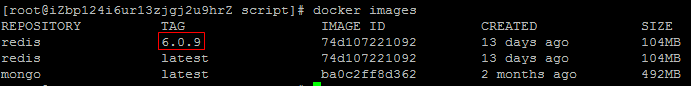
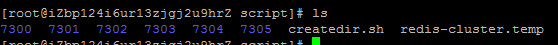
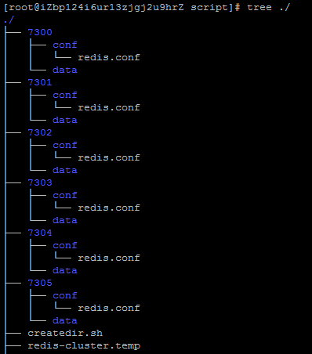
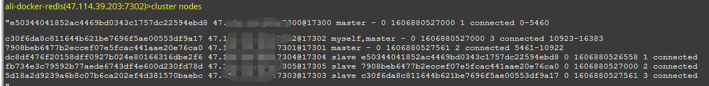

[TOC]
## docker搭建redis-cluster(公网可访问)
网上很多教程，但是那些都无法在公网中进行访问，自己尝试了一番后可以了，做个记录吧。
### 获取redis镜像
可以从[dockerhub]( https://hub.docker.com/_/redis?tab=tags)里面找你想要的redis版本号，然后执行 docker pull redis:{版本号},得到redis镜像。


### redis配置 
本次配置，使用的是docker网络模式中的host模式，也就是每一个docker容器的ip和主机ip相同。
本次配置希望可以做到公网访问，最终的目标redis网络结构如下。

| 主节点ip | 主节点端口 | 从节点ip | 从节点端口 |
| ------- | ------- | ------- | ------- |
| 公网ip | 7300 | 公网ip | 7303| 
| 公网ip | 7301 | 公网ip | 7304| 
| 公网ip | 7302 | 公网ip | 7305| 

可以创建一个专门的目录，存放后续redis-cluster搭建相关的文件和目录。我这里创建了一个script目录。后续所有的操作都是在script目录中进行的。

#### 单个redis配置 
创建一个redis-cluster.temp文件，作为每个redis配置的模板文件。
```
port ${PORT}
bind 0.0.0.0
cluster-enabled yes
cluster-config-file nodes.conf
cluster-node-timeout 5000
cluster-announce-ip 公网ip
cluster-announce-port ${PORT}
cluster-announce-bus-port 1${PORT}
appendonly no
```

| 参数 | 含义 | 填入值 |
| ------- | ------- | ------- |
| port | redis 端口号 | 端口号 |
| bind | ip 访问白名单 | ip , 0.0.0.0表示任意ip |
| cluster-enabled | 开启集群模式 | yes/no |
| cluster-config-file | 请注意，尽管有此选项的名称，但这不是用户可编辑的配置文件，而是Redis群集节点每次发生更改时自动保留群集配置（基本上为状态）的文件，以便能够 在启动时重新读取它。总之就是照着写，不用管，是redis自己用的。 | nodes.conf |
| cluster-node-timeout | Redis群集节点可以不可用的最长时间，而不会将其视为失败。 如果主节点超过指定的时间不可达，它将由其从属设备进行故障切换。 | 毫秒数 |
| cluster-announce-ip | 集群节点的ip。个人理解是，集群中的node信息，存的就是这个ip。客户端就是在选择好目标节点后会根据这个ip向目标节点发送命令。所以，如果要公网访问，那这里的ip要填写成公网IP地址。如果是局域网访问，那就填局域网ip即可。总之，就是要填写客户端能够到达的ip。 | ip地址 |
| cluster-announce-port | 集群节点的端口号 | 端口号 |
| cluster-announce-bus-port | Redis集群通过总线进行节点间的数据交换，每个Redis节点都会开辟一个额外端口与总线进行TCP连接，以二进制形式进行数据交换。 | 一般是Redis port加上10000 |
| appendonly | 是否开启redis的持久化。 | yes/no |

#### 使用脚本生成3主3从的配置文件和目录
创建一个createdir.sh文件，批量的创建各个节点redis的配置文件和目录。
```
for port in $(seq 7300 7305);
do
  netport=$[port-7297];
  mkdir -p ./${port}/conf && PORT=${port} envsubst <./redis-cluster.temp> ./${port}/conf/redis.conf && mkdir -p ./${port}/data;
done
```
执行过后script内容如下 



更详细的内容



#### 启动各个redis容器
使用命令启动容器
```
docker run -p 7300:7300 -p 17300:7300 --name redis-1 
-v /root/script/7300/conf/redis.conf:/usr/local/etc/redis/redis.conf  
-v /root/script/7300/data:/data  
-d --net host 
redis:6.0.9 redis-server /usr/local/etc/redis/redis.conf
```

| 参数 | 含义 |
| --- | --- |
| -p 7300:7300 -p 17300:7300 | 端口的映射 |
| --name redis-1  | 容器命名为redis-1 |
| 两个-v的参数 | 应该是将容器中的目录地址映射到宿主机的实际地址中 | 
| -net host | 使用docker的host网络模式，各个容器的ip和宿主机ip相同 |
| redis:6.0.9 | 具体的redis镜像 |
| redis-server /usr/local/etc/redis/redis.conf | redis指定启动文件启动，这里的文件实际是映射到了/root/script/7300/conf/redis.conf | 

修改端口号和目录，依次启动剩余5个容器。
```
docker run -p 7300:7300 -p 17300:7300 --name redis-1 -v /root/script/7300/conf/redis.conf:/usr/local/etc/redis/redis.conf  -v /root/script/7300/data:/data  -d --net host redis:6.0.9 redis-server /usr/local/etc/redis/redis.conf
docker run -p 7301:7301 -p 17301:7301 --name redis-2 -v /root/script/7301/conf/redis.conf:/usr/local/etc/redis/redis.conf  -v /root/script/7301/data:/data  -d --net host redis:6.0.9 redis-server /usr/local/etc/redis/redis.conf
docker run -p 7302:7302 -p 17302:7302 --name redis-3 -v /root/script/7302/conf/redis.conf:/usr/local/etc/redis/redis.conf  -v /root/script/7302/data:/data  -d --net host redis:6.0.9 redis-server /usr/local/etc/redis/redis.conf
docker run -p 7303:7303 -p 17303:7303 --name redis-4 -v /root/script/7303/conf/redis.conf:/usr/local/etc/redis/redis.conf  -v /root/script/7303/data:/data  -d --net host redis:6.0.9 redis-server /usr/local/etc/redis/redis.conf
docker run -p 7304:7304 -p 17304:7304 --name redis-5 -v /root/script/7304/conf/redis.conf:/usr/local/etc/redis/redis.conf  -v /root/script/7304/data:/data  -d --net host redis:6.0.9 redis-server /usr/local/etc/redis/redis.conf
docker run -p 7305:7305 -p 17305:7305 --name redis-6 -v /root/script/7305/conf/redis.conf:/usr/local/etc/redis/redis.conf  -v /root/script/7305/data:/data  -d --net host redis:6.0.9 redis-server /usr/local/etc/redis/redis.conf
```

#### 构建redis集群
通过某一台redis容器执行构建集群的命令即可
```
docker exec -it redis-1 redis-cli -p 7300 --cluster create 公网ip:7300 公网ip:7301 公网ip:7302 公网ip:7303 公网ip:7304 公网ip:7305 --cluster-replicas 1
```

#### 公网连接校验
我的机器是在阿里云上，在本地通过阿里云的外网ip连接测试成功。执行cluster nodes如下:

可以看到node里面的ip信息是公网ip。

### 问题和优化
+ 执行 Waiting for the cluster to join 这一步一直卡着。   
    可能是因为阿里云的端口没有打开，不止7300、7301这些要开，17300这些也要开。
+ 设置密码。     
    在每个reids的配置文件中加入 masterauth {password} 和 requirepass {password}即可。
 
### 常用docker命令  
+ docker stop $(docker ps -a -q)
+ docker rm $(docker ps -a -q)