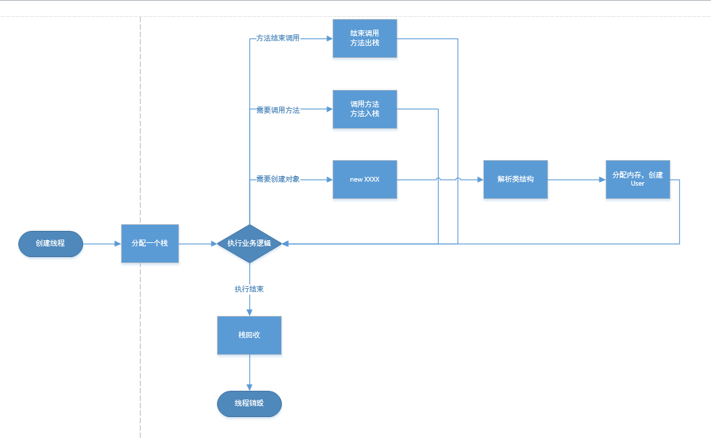
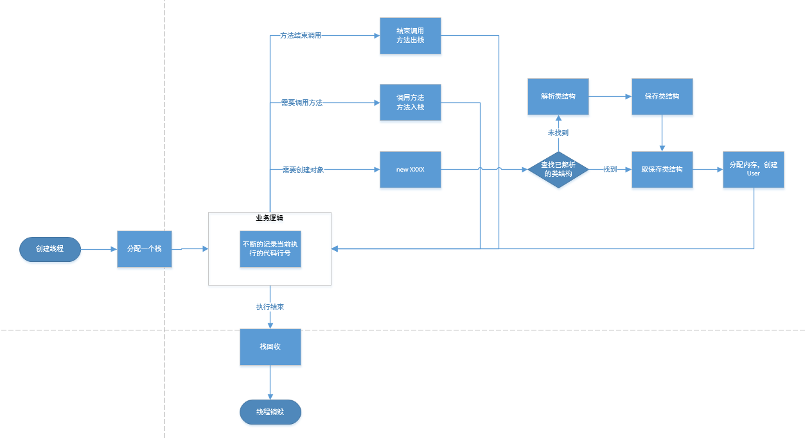
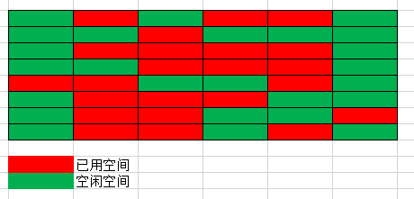
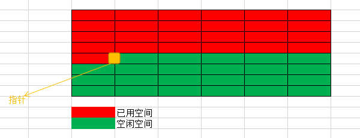

[TOC]
## 1. jdk/jre/jvm的关系

### jvm
* 全称 java virtual machine，java虚拟机，java程序运行的基础，本质是一套规范，规定了虚拟机内存的管理方式，class文件的格式等。具体的虚拟机是由不同厂商实现的，比如Hotspot。
* 是java语言平台无关性的基石，通过jvm隔绝了操作系统的区别。
* 本质上，jvm执行的是class文件，只要符合jvm规范的class文件都可以被执行，因此其他语言比如ruby编译后得到的class文件也可以运行在java虚拟机上。jvm可以做到平台无关，甚至编程语言无关。

### jre
全称 java runtime environment，是支持java程序运行的标准环境。包含了jvm和java SE API。

### jdk
全称java development kit，是支持Java程序开发的最小环境。包括了jre和jvm。

## 2. 虚拟机运行探究

java程序的运行，其实就是创建一个个对象，然后执行对象里面的方法的过程。那么对象是如何创建，方法是如何执行的呢？现在假设我要创建一个叫做mj的虚拟机，需要怎么做呢？

### mj虚拟机问世
#### new一个对象
我们都知道，创建一个对象最简单的方式就是new一个，那么new一个对象的时候，到底干了些啥呢，下面让我们大胆的猜测一下。
现在有个User对象如下，有name和age属性，还有对应的getName等方法。现在我们执行new User()，会发生什么呢。

假设需要创建一个对象，首先得知道这个对象是什么样的吧，类名是什么，实现了什么接口，有什么静态变量，什么属性，哪些方法等等。也就是说我总得先知道这个类的结构吧。所以我肯定要先把这个类的结构解析一下。好，那现在需要创建的对象有什么结构知道了，那我就在内存里面分配一个空间，记录下属性、变量、方法等等，那这个对象就创建好了。

#### 方法的执行
好，现在对象在内存里面也有了，我们有了对象，就可以执行他的方法，程序运行不就是一个方法调用另一个方法么。那这个过程我们的虚拟机要怎么实现呢？

我们看看方法调用的过程，A调用B，B调用C，C执行完，返回，然后B执行完，返回，然后A执行完，返回。先执行的方法后结束，这个像什么结构？对，像栈，先进后出。好，那我从第一个方法执行的时候就给它一个栈，调用一个方法就在栈里面记一下方法的信息，执行完了把这个方法的信息出栈，这样的话这个栈不就是方法调用到结束的过程了嘛。但是，我怎么判断什么时候是第一个方法执行呢？我们java程序的执行不是以线程为单位的么，想要开始执行方法，肯定在线程里面吧，那好，那我们就在创建java线程的同时，分配一个栈，用来记录线程里面方法的调度和执行。

#### 问题和优化
很好，现在mj虚拟机第一版已经大致出炉了，运行逻辑如下

嗯，看着好像可以运行。然后就拿着这个虚拟机跑了起来。
因为我们的计算机cpu运行的时候是个每个线程分配时间片的，每个线程跑一会儿可能就切到另一个线程了，我们的虚拟机一运行就不行了，因为一旦切换线程然后切换回来就丢失了运行的信息了，简单讲，就是不知道自己执行到哪一行代码了。不过这个好办，我们在一个地方记录每次执行的地址不就得了么。运行逻辑这就调整了一下，如下:

好，现在切换线程也不怕了。虚拟机起码跑了起来。
跑了一会儿，我们发现这个性能不咋地啊，没关系，看看虚拟机都在干些啥。不看不知道，一看吓一跳，怎么一个个线程都在解析类的结构啊？奥，因为我们每一次new一个对象都要解析一次。这个好像可以优化，因为类的结构不是不变的么，我们把类静态的结构拿出来，这样只要第一次创建对象的时候解析一下就好了额。运行逻辑又优化了一下，如下:

很好，现在这个mj虚拟机已经可以跑起来了，每个类被解析之后存起来，下次new对象时就不用重复解析了；通过每个线程都有的一个栈，记录了线程里面方法的调度与执行；用了一块内存，不断的记录程序当前执行的行号，线程切换也没关系了。

然后这个mj虚拟机问世了，卖了很多钱。

### mj虚拟机总结
虽然不存在这个mj虚拟机，但是这个mj虚拟机一定程度上是可以反映java虚拟机的运行机制的。  

* 每个类解析的过程，被称为类加载；
* 解析之后会把类静态结构存储起来，存储的地方叫做方法区；
* 每个线程都有的那个栈，被称为java虚拟机栈，每次方法调用的时候都会把方法的信息记录到一个叫做栈帧的东西里面，然后入栈。
* 因为可能会执行一些操作系统的方法，比如C++库的方法，所以还有一个本地方法栈，类似虚拟机栈；
* 那个我们用来记录程序当前执行的行号的，叫做程序计数器；
* 我们用来生成对象的地方，叫做堆。

## 3. 运行时数据区域
java虚拟机的运行机制远比mj虚拟机要复杂，先来看看其运行时数据划分的区域，了解一下有哪些区域以及各个区域的作用。

### 程序计数器
显然是线程私有的，如果线程正在执行的是一个Java方法，那这个计数器记录的是正在执行的虚拟机字节码指令的地址；如果正在执行的是Native方法，这个计数器值则为空。
他所占用的空间很小，但是根据虚拟机规范的描述，他的空间一定要能容纳方法或者native的返回地址。个人觉得64位就够了。
因为占用空间很小，而且绝对足够，这里是java虚拟机中唯一规定的不会发生内存溢出的地方。

### java虚拟机栈
记录的是每个线程中方法的调度信息，显然也是线程私有的。由栈帧组成，每个栈帧保存了局部变量表、操作数栈、动态链接、方法出口等信息。这些信息都是用来完成方法中的计算和计算结果的返回的。
既然是栈，那么栈的深度肯定是有个上限的，因此该区域是可能会发生内存溢出的。发生的情况有三中。

+ 1、 方法嵌套调用太多，甚至无限的递归，导致栈满了，会抛出StackOverflowError。
+ 2、 每个方法内部的局部变量太多，导致每个栈帧很大，同时方法调用又不少，导致栈满了，会抛出StackOverflowError。
+ 3、 开启了无数个线程，不足以给新的线程分配栈了，会抛出 OutOfMemoryError，这种情况比较少出现。

### 本地方法栈
和java虚拟机类似，不过他作用的是native方法。

### 方法区
存储已被虚拟机加载的类信息、常量、静态变量、即时编译器编译后的代码等数据，也就是和类相关的一些静态的结构信息。每个类结构都是不变的，不需要每次都解析，所以显然方法区里的类信息是可以被多个线程共享的。

你可能听说过一个叫“永久代”的名词，其实这个永久代就是hotspot虚拟机中对方法区的一种实现，不过在jdk1.8以后，hotspot虚拟机也不再使用永久代来实现方法区了，改为用元空间来实现，具体的区别后续文章会进行讲解。

类解析之后的信息会一直放在方法区中，如果程序中创建的类无限制的增加，那方法区也可能出现内存不足而溢出。

### 堆 
堆也是线程共享的一块内存区域，用来给对象或者数组分配空间，这里也是垃圾收集器工作的主要区域。堆中对于内存的分配和回收还大有文章，比如多个线程都在创建对象的情况下，怎么保证各个线程里的对象不会分配到同一块空间？比如如何提高垃圾回收的效率？这些个问题也会在后面的文章里面提及。

显然，堆也是可能出现内存溢出的。

## 3. 堆内存分配
《深入理解java虚拟机》第二章有一节专门讲解了hotspot虚拟机在堆中是如何分配内存的。下面对书中的内容以自己的理解进行一个记录。

通过上面的讲解，我们知道，在创建对象之前，得先知道类的结构，也就是至少要执行一次类加载，得到类的静态信息。得到这个静态结构信息之后，就要在堆里面分配内存。那么这个分配内存是个怎样的过程呢？

#### 对象的大小
需要明确的是，对象的大小是可计算的的。对象由什么组成，静态变量、实例属性、静态方法、实例方法，静态变量和方法，都保存在了方法区，堆中对象需要保存的只是对象的实例属性和部分结构信息。结构信息的大小肯定固定，实例属性无非就是java的几大基本数据类型或者引用，这些都是规定好了长度的，所以每次new对象的时候，需要分配多少内存是可以确定的。

说到这个对象的大小，必然要说到java中各种数据类型的大小。

+ byte: 1字节，8位，表示范围 -128~127，默认值为0。
+ short: 2字节，16位，-2^15~2^15-1，默认值为0。
+ char: 2字节，16位，0~65535，默认为null，值为'\u0000'。
+ int:4字节，32位，-2^31~2^31-1，默认为0。
+ long:8字节，64位，-2^63-1~2^63,默认为0。
+ float:4字节，32位，3.4e-45~1.4e38。
+ double:8字节，64位，4.9e-324~1.8e308。
+ boolean: 对于存储来说，这个是比较特殊的一种类型，boolean本质上只有true或false两个值，理论上1bit即可存储，但是java虚拟机规范规定单个boolean值使用int也就是32位存储，boolean数组中的boolean使用byte8位来存储。

#### 对象在堆内的布局
那对象在堆内部到底有哪些东西组成呢？在HotSpot虚拟机中，可以分成三块，对象头、实例数据和对齐填充。
    
+ 对象头   
    分为两部分，一部分称为mark word，可能是32位，也可能是64位，具体看虚拟机。主要保存运行时对象自身的数据，比如哈希码、gc分代年龄、锁状态标志位、偏向锁ID等等。mark word在对象处于不同状态时，存储的内容也是不同的，达到了不同状态下对32位/64位空间的一个复用。下面图是《深入理解java虚拟机》中的插图，表示了不同状态下mark word存储的内容。  
       
    这张图里面标志位有两个01，当时我很费解，有两个01那怎么区分。后来终于理解了，应该是2个标志位加上后面1位的状态位，可以唯一的确定对象的一个状态。也就是说其实是标志位+状态位来确定mark word的内容。

    还有一部分是类型指针，通过这个指针来确定这个对象是哪个类的实例。我的理解是，这个指针指向了方法区中对应类的结构定义。

+ 实例数据  
    保存各种属性字段。
+ 对齐填充  
    由于HotSpot VM的自动内存管理系统要求对象起始地址必须是8字节的整数倍，换句话说，就是对象的大小必须是8字节的整数倍。因此有时候需要对对象空间进行填充。

一个对象在内存中的可能布局如下:


#### 对象内存的分配

+ 空闲列表  
    对象大小确定好了以后，需要从堆里面找到一块空的内存，分配给这个对象。如何找到空的内存呢？最容易想到的，就是我记录一下，哪些内存空间是可用的，哪些是已经分配了的，然后每次分配的时候呢就从可用空间里面取一块出来分配，就好了。回收的时候把这部分空间又标记成可用的。

    但是这样用的后果，就是内存会变的不规整，空闲内存和已用内存都是随机的，不规整的，如果一个对象需要的内存很大，甚至可能无法找到一个连续的空闲内存给它。比如下图，想要创建一个5格的对象就不可能了。这种分配方式，叫做空闲列表。

    

+ 指针碰撞  
    以空闲列表的方式分配内存，可允许内存不规整，已用和空闲内存交替存在。但是如果保证内存是规整的，所有已用内存和空闲内存是分开两部分的，那就可以用指针碰撞的方式来分配内存。

    简单来说，就是维护一个已用内存和空闲内存交界处的指针，每次需要分配内存的时候，就将这个指针向空闲内存方向移动一段距离即可。   
    

#### 并发下的内存分配

对象创建在虚拟机中是非常频繁的行为，即使是仅仅修改一个指针所指向的位置，在并发情况下也并不是线程安全的，有可能给A分配对象的同时，线程B发现这一块内存空着，又分配给了B对象。
这个问题有两种解决方案。

+ 分配空间时加锁   
    显然，最容易想到的就是既然线程会出现竞争的情况，那就加个锁呗，这个空间谁先抢到就归谁。
+ TLAB  
    本地线程分配缓冲（ThreadLocal Allocation Buffer，TLAB），就是在堆里面，给每个线程预先分配一块空间，每个线程创建对象的时候先在自己的这个空间里面找空间，如果空间不够，可以向堆内存再申请一块TLAB，只有申请TLAB的时候，才需要做加锁。

#### 对象的访问定位
从前面的内容，可以知道，执行一个方法的时候，是把这个方法的信息保存在一个栈帧里面，压倒虚拟机栈里面。这个信息就包括局部变量，那如果这个局部变量如果是一个对象，比如这个方法
```
public void X(){
    User user = new User();   
}
```
这个方法中的局部变量user，存在栈帧中，而其对应的实际的User对象，是在堆内存中的，那么这个局部变量是如何与堆中的对象关联起来的呢？

+ 句柄    
    使用句柄的话，需要在堆内部划分一块区域出来专门维护句柄池，这个句柄内存放对象的类信息地址和实例信息地址。局部变量中存的，只是这个句柄池中句柄的地址。如下图:
    
    
    这有什么好处呢，因为堆中存在垃圾回收的机制，对象在堆里面可能会被移过来移过去，它的地址是不停在变化的，有了句柄，每次地址发生变化的时候，只需要改变句柄中存的地址即可
    ，而不需要改变局部变量中的值。

    但是访问对象的时候，需要先查句柄，然后才能访问到对象，访问效率会低一点。
    
+ 直接指针  
    直接指针，局部变量中指向的，直接就是堆内存中实例对象的地址，在这个实例对象内部，维护了其类信息的地址。
       
    这有什么好处呢，显然会更快，因为可以直接访问到对象。但是对象移动的时候必须更新局部变量中的指向。

hotspot虚拟机采用的是直接指针来作为对象访问定位的方法。

### 总结
通过《深入理解java虚拟机》第二章的学习，知道了jvm内部数据区域的一个划分，很大概的了解到了一个对象的产生过程，方法的执行过程。  

+ 通过类加载，解析类的结构，把类的静态信息存在方法区。
+ 线程跑起来的时候，需要有程序计数器，记录代码运行的地址信息，不然切换线程之后不知道执行到哪里了。
+ 每个线程都会有一个栈，java方法调用的时候，会把方法的一些信息组到栈帧里面，压人栈，方法调用的开始和结束，对应栈帧的出栈和入栈。这些栈的空间，都是从一个叫做java虚拟机栈的区域里分配的。
+ 因为有native方法的调用，所以还有个本地方法栈，和虚拟机栈功能类似。
+ 对象的分配都在堆里面。分配对象内存的方式有空闲列表和指针碰撞。
+ 因为对象的创建时并发的，可能会出现线程安全的问题，解决办法有分配对象控件时直接加锁和使用TLAB空间。
+ 堆里面对象和方法栈中局部变量的联系可以通过句柄和直接指针，hotspot虚拟机使用的是直接指针方式。
+ hotspot对象在堆里面，需要存三部分的信息，对象头、实例信息和补齐填充，对象的地址都是8字节的倍数。
+ java各种数据类型的占用空间，其中boolean比较特殊，单个boolean底层是32位，boolean数组是8位。