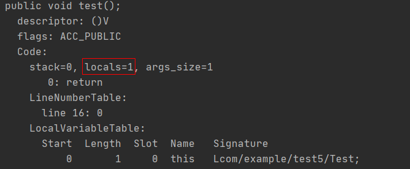

[TOC]
## 虚拟机栈
线程私有，由一个个栈帧组成，每个栈帧对应着一个调用的方法，保存有方法的局部变量等信息。方法被调用时栈帧入栈，方法结束调用时栈帧出栈。
### 出栈和入栈
可以结合下面的代码合来看下栈帧的出入栈过程。下面代码，在Main函数中调用methodA，执行完之后返回。
```
public class Test {
    public static void main(String[] args) {
        Test test = new Test();
        test.methodA();
    }

    public void methodA(int x, int y) {
        int a = 1;
        int b = a + x;
        int c = b + y;
        return c;
    }
}
```

+ 1、 在开启main函数主线程的同时，会在虚拟机栈中分配一个栈空间，用于main函数主线程的方法调用。
+ 2、 主线程调用main函数，创建创建main函数栈帧，入栈。
+ 3、 main函数调用methodA，创建methodA函数栈帧，入栈。
+ 4、 methodA函数执行完毕，方法返回，栈帧出栈。
+ 5、 main函数执行完毕，方法返回，栈帧出栈。
+ 6、 主线程执行完毕，栈空间释放。


### 栈帧结构
每个栈帧存储的是一个方法的信息，那么，一个方法，都由什么组成呢？

```
    public int test(Human human,int x) {
        int a = x;
        human.test();
        return a+x;
    }
```
看上面这个方法，有public访问修饰符,int返回值类型，test方法名，human入参，return 0 返回值，局部变量a，还有具体的计算逻辑。这些东西可以分成静态和动态的，访问修饰符、方法名这些属于方法的结构，是静态信息，直接存放在方法区里面。而局部变量、出入参这些，每一次调用可能都不一样，属于动态信息，这部分信息放在栈帧里面。
具体的，栈帧由局部变量表、操作数栈、动态链接和返回地址组成。

#### 局部变量表
顾名思义，局部变量表，存放的是方法执行过程中产生的局部变量，包括方法内定义的变量、方法参数，比如上例中的int a。 方法中的局部变量在编译期就可以确定有哪些，因此局部变量表是固定的大小，由class文件Code属性中的 max_locals 确定(max_locals可以使用javap命令看到，可以自行百度个教程看下)。一个方法一般都是很复杂的，有很多的if else分支，那难道局部变量表会存放所有的出现局部变量么？我们可以结合javap来探究一下。

+ 空方法、空入参的局部变量  
    可以看下下面的方法，局部变量表大小是多少呢？你也许会说，没有入参，方法也没定义变量，显然是0个。
```
    public void test() {
    }
```
    但是使用javap命令之后，可以看到test方法对应的 max_locals = 1 。
    
    为什么空方法也会占用一个局部变量的空间呢？虚拟机规范里其实有答案。
    关于局部变量表，虚拟机规范有这么一段描述:
    ```
    On instance method invocation,local variable 0 is always used to pass a reference 
    to the object on which the instance method is being invoked (this in the Java programming language). 
    在实例方法里面，局部变量表的第一个总是用来存放一个方法调用者对象的引用(也就是java语法里的this)。
    ```
    看完这个就了解了，因为这个test方法是个实例方法，因此局部变量表默认有个this的引用，因此 max_locals = 1 。

    那如果是静态方法呢？有兴趣可以尝试一下，把这个test方法改为static方法，max_locals会是0。

+ 输入参数  
    输入参数也是动态的，在运行期间才知道的，没法放在方法区，应该也放在局部变量表才对。可以来验证一下。
    下面方法有两个输入参数，结合上this，这个方法的局部变量表大小应该为3才对。
    ```
    public void test(int a, int b) {
    }
    ```
    执行javap看下，确实是3，
    

+ if分支  
    那if分支里定义的局部变量，怎么算呢？因为只有执行的时候才知道会进哪个分支，使用到哪些局部变量啊。
    这里猜测可能会有两种情况，一种是不管你有几个分支，只要出现局部变量，都算。还有一种比较智能，既然是分支，那么同级的分支之间可定是互斥的，那么就在所有可能执行的分支路径中，找到一个使用局部变量最多的，作为代码中局部变量的大小。

    看下面的方法，按照第一种算法，局部变量是所有分支的总和，那就有6个，加上入参和this，max_locals = 9 ；按照第二种算法，局部变量分支最多的是4个，那 max_locals = 7 。
    ```
    public void test(int a, int b) {
        if (a == 1) {
            int s1 = 0;
            int s2 = 0;
        } else {
            int s1 = 0;
            int s2 = 0;
            int s3 = 0;
            int s4 = 0;
        }
    }
    ```
    javap之后......
    
    结果是7个，看来jvm比较智能，会取一个最大值，而不是简单的全部相加。其实这也比较合理，毕竟即使是编译期间，也可以知道代码可能的执行路径，那就没有必要全部分支的局部变量相加了。    
    ***如果把上面方法中的if条件换成 if(true) ， 再用javap来看 max_locals = 5 。***

总结一下，局部变量表存着入参和局部变量，如果是实例方法还有一个this引用，局部变量表的大小取决于代码所有可能执行的分支路径里面，局部变量最多的那个。

#### 操作数栈
首先，得先了解一下指令集的架构。可以看下这篇文章 [基于栈与基于寄存器的指令集架构](https://blog.csdn.net/pq258280920/article/details/25877265)。
看完之后你就知道，咱们javaee的开发者用的jvm，都是用的基于栈的指令集。而我们的操作数栈，就是用于方法中的计算。栈的最大深度，其实也是可以在编译器确定的，存放在class文件code属性的 max_stacks 中。

#### 动态链接
个人对于这个的理解比较简单，因为java是存在多态和继承的，有些方法调用在类加载时没法确定到底调用的是哪个类的方法，只有在运行的时候才能确定下来，所有就有了动态链接。
看下面的例子。
+ 例1    
```
    public class Test {

        public static void test1() {
            System.out.println("test1");
        }

        public void action() {
            Test.test1();
            this.test2();
        }

        private void test2() {
            System.out.println("test2");
        }
    }
```
上面的action方法，调用了静态方法test1和私有方法test2，因为静态方法和私有方法不能被重写，因此这个action方法需要调用的方法是明确的，固定的。在类解析阶段，这个action方法的结构就会被放到方法区里面，所有实例对象不需要自己再去做什么操作就可以调用这个action方法。

+ 例2    
```
    public class Test {
        public void action(Human human) {
            human.test();
        }
    }

    abstract class Human {
        public abstract void test();
    }

    class Man extends Human {
        @Override
        public void test() {
            System.out.println("human");
        }
    }

    class Woman extends Human {
        @Override
        public void test() {
            System.out.println("women");
        }
    }
```
这个例子里的action方法，因为human存在Man和Woman两个实现，这个human.test()的方法调用时不明确的，类加载的时候只能知道是执行human的实现之一，但是到底是Man还是Woman呢，没法确定。每个实例对象执行这个action的时候，可能会调用到不同的实现。这种方法的调用，就要放在动态链接里面。

如果了解了类加载机制，就会知道类加载的解析过程，实际上就是将类似于例1中，这些确定的固定的符号引用转换成直接引用；动态链接，就是在运行期间，将类似例2这种不确定不固定的符号引用转换成直接引用。(至于啥事符号引用，可以自行百度下)。

#### 返回地址/方法出口
一个方法的结束有两种方式，return或者异常。return方式的结束就是通过栈帧来完成的。
虚拟机规范中关于return方式的描述:

```
The current frame (§2.6) is used in this case to restore the state of the invoker,
including its local variables and operand stack, with the program counter of the
invoker appropriately incremented to skip past the method invocation instruction.
Execution then continues normally in the invoking method's frame with the
returned value (if any) pushed onto the operand stack of that frame.

大概的意思就是，当前栈会保存调用者的局部变量表和操作数栈，方法正常执行完毕之后，会恢复调用者局部变量表和操作数栈，同时把返回值压如操作数栈。
```


