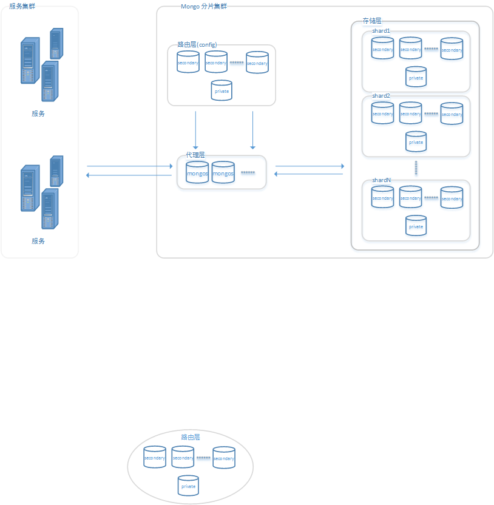

[TOC]

#4. 分片

#4.1 分片集群的结构

在我看来，分片集群其实是分为了三层，**代理层** 、 **路由层** 和 **存储层**。

- **存储层**   
    + 具体的存储数据的单元，由多个副本集组成，每个副本集是一个单独的存储分片(shard)。

- **路由层**   
    + 存储数据库和集合的分片信息。

- **代理层** 
    + 分片集群对外提供服务的代理，本身不存储任何数据。
    + 和路由层交互，当请求到达时，先查询路由层存储中的集合配置。
    + 和存储层交互，当根据路由层的配置得到存储层中确切的目标时，去存储层的shard中查询数据，并将取回的数据进行加工(比如group操作)。

/usr/local/mongoDB/bin/mongod --port 27023 --dbpath=/www/mongoDB/shard/s3 --logpath=/www/mongoDB/shard/log/s3.log --logappend --fork/root/

port=27018
dbpath=/root/dev/data/mongodb_rep1
logpath=/root/dev/data/log/mongodb_rep1.log
logappend=true
fork=true

/usr/local/mongoDB/bin/mongod --port 27023 --dbpath=/www/mongoDB/shard/s3 --logpath=/www/mongoDB/shard/log/s3.log --logappend --fork/root/

- shard
/root/dev/mongodb/mongodb-linux-x86_64-4.0.3/bin/mongod --port 27017 --dbpath=/root/dev/data/mongodb_s1 --logpath=/root/dev/data/log/mongodb_s1.log --bind_ip=0.0.0.0 --logappend --fork --shardsvr --replSet shard1 

/root/dev/mongodb/mongodb-linux-x86_64-4.0.3/bin/mongod --port 27016 --dbpath=/root/dev/data/mongodb_s2 --logpath=/root/dev/data/log/mongodb_s2.log --logappend --fork  --shardsvr  --replSet shard2

/root/dev/mongodb/mongodb-linux-x86_64-4.0.3/bin/mongod --port 27015 --dbpath=/root/dev/data/mongodb_s3 --logpath=/root/dev/data/log/mongodb_s3.log --logappend --fork  --shardsvr  --replSet shard3

 --shardsvr 

- config

/root/dev/mongodb/mongodb-linux-x86_64-4.0.3/bin/mongod --port 27100 --dbpath=/root/dev/data/mongodb_s4 --logpath=/root/dev/data/log/config.log --logappend --fork --configsvr --replSet conf

/root/dev/mongodb/mongodb-linux-x86_64-4.0.3/bin/mongod --port 27101 --dbpath=/root/dev/data/mongodb_s5 --logpath=/root/dev/data/log/config2.log --logappend --fork --configsvr  --replSet conf

/root/dev/mongodb/mongodb-linux-x86_64-4.0.3/bin/mongod --port 27102 --dbpath=/root/dev/data/mongodb_s6 --logpath=/root/dev/data/log/config3.log --logappend --fork --configsvr  --replSet conf 

- mongos
/root/dev/mongodb/mongodb-linux-x86_64-4.0.3/bin/mongos --port 40000 --fork --logpath=/root/dev/data/log/route.log --bind_ip=0.0.0.0 --configdb conf/127.0.0.1:27100,127.0.0.1:27101,127.0.0.1:27102

sh.addShard("shard1/127.0.0.1:27017")
sh.addShard("shard2/127.0.0.1:27016")
sh.addShard("shard3/127.0.0.1:27015")

config = {
    _id:'conf',
    protocolVersion : 1,
    members:[
        {_id:0,host:'127.0.0.1:27100'}
    ]
}

/root/dev/mongodb/mongodb-linux-x86_64-4.0.3/bin/mongod 

Failed to connect to 127.0.0.1:27102 - InvalidOptions: Surprised to discover that 127.0.0.1:27102 does not believe it is a config server

db.runCommand( { shardcollection : "testdb.table2",key : {_id: 1} } )
for(i=1;i<=1000;i++){db.model.insert({id:i,name:"Leo"+i})}

db.table2.insert({id:1,name:"Leo"})

db.runCommand( { enablesharding :"mj"});
db.runCommand( { shardcollection : "mj.model",key : {name: 1} } )
db.model.insert({id:1,name:"Leo"})

