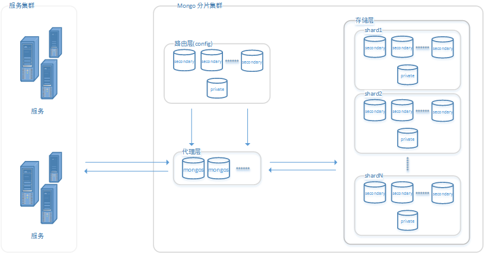
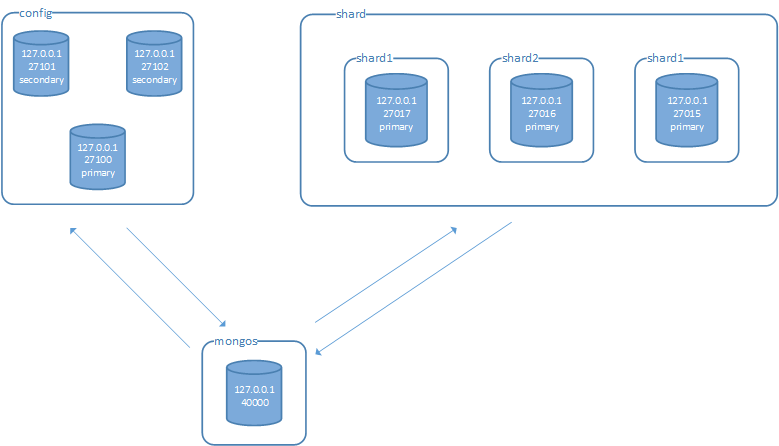

[TOC]

#4. 分片

##4.1 分片集群的结构

在我看来，分片集群其实是分为了三层，**代理层** 、 **路由层** 和 **存储层**。



- ### **存储层**   
    + 具体的存储数据的单元，由多个副本集组成，每个副本集是一个单独的存储分片(shard)。

- ### **路由层**   
    + 存储数据库和集合的分片信息。必须是副本集。

- ### **代理层** 
    + 分片集群对外提供服务的代理，本身不存储任何数据。
    + 和路由层交互，当请求到达时，先查询路由层存储中的集合配置。
    + 和存储层交互，当根据路由层的配置得到存储层中确切的目标时，去存储层的shard中查询数据，并将取回的数据进行加工(比如group操作)。

##4.2 分片集群的搭建     

- ### **具体组成**    

    
 
    + 存储层   
        3个副本集，每个副本集只有1个节点。3个节点分别为127.0.0.1:27017、127.0.0.1:27016、127.0.0.1:27015。
    + 路由层   
        1个副本集，由3个节点组成，分别为127.0.0.1:27100、127.0.0.1:27103、127.0.0.1:27102。
    + 代理层   
        1个mongo进程，不需要存储数据，127.0.0.1:40000。

- ### **搭建步骤**
    + #### 构建存储层
        
        3个副本集，每个副本集只有1个节点。3个节点分别为127.0.0.1:27017、127.0.0.1:27016、127.0.0.1:27015。

        ```
        -- 启动127.0.0.1:27017的mongo进程 -- 
        /root/dev/mongodb/mongodb-linux-x86_64-4.0.3/bin/mongod --port 27017 --dbpath=/root/dev/data/mongodb_s1 --logpath=/root/dev/data/log/mongodb_s1.log --logappend --fork  --shardsvr  --replSet shard1

        -- 启动127.0.0.1:27016的mongo进程 -- 
        /root/dev/mongodb/mongodb-linux-x86_64-4.0.3/bin/mongod --port 27016 --dbpath=/root/dev/data/mongodb_s2 --logpath=/root/dev/data/log/mongodb_s2.log --logappend --fork  --shardsvr  --replSet shard2

        -- 启动127.0.0.1:27015的mongo进程 -- 
        /root/dev/mongodb/mongodb-linux-x86_64-4.0.3/bin/mongod --port 27015 --dbpath=/root/dev/data/mongodb_s3 --logpath=/root/dev/data/log/mongodb_s3.log --logappend --fork  --shardsvr  --replSet shard3
        ```

        启动进程的时候，必须指定 "--shardsvr" 参数，显式的声明这是分片数据的服务，否则后续的构建会报错。

        启动完进程之后，需要初始化副本集。以初始化127.0.0.1:27017为例。

        ```
        -- 进入27017的mongo客户端程序 --
        [root@iZbp124i6ur13zjgj2u9hrZ bin]# /root/dev/mongodb/mongodb-linux-x86_64-4.0.3/bin/mongo --port 27017

        -- 设置config -- 
        shar1:副本集名称
        members:副本集节点集合

        config = {
            _id:'shard1',   
            protocolVersion : 1,
            members:[
                {_id:0,host:'127.0.0.1:27017'}  
            ]
        }

        -- 执行初始化 --
        rs.initiate(config) 
        ```

        另两个副本集同样进行初始化即可。

    + #### 构建路由层
        
        和构建存储层一样，需要启动节点，然后初始化。不过路由层这里使用了3个节点的副本集，初始化时config稍有不同。

        ```
        -- 启动mongo进程，副本集名称相同 --
        /root/dev/mongodb/mongodb-linux-x86_64-4.0.3/bin/mongod --port 27100 --dbpath=/root/dev/data/mongodb_s4 --logpath=/root/dev/data/log/config.log --logappend --fork --configsvr --replSet conf

        /root/dev/mongodb/mongodb-linux-x86_64-4.0.3/bin/mongod --port 27101 --dbpath=/root/dev/data/mongodb_s5 --logpath=/root/dev/data/log/config2.log --logappend --fork --configsvr  --replSet conf

        /root/dev/mongodb/mongodb-linux-x86_64-4.0.3/bin/mongod --port 27102 --dbpath=/root/dev/data/mongodb_s6 --logpath=/root/dev/data/log/config3.log --logappend --fork --configsvr  --replSet conf

        -- 进入任意一个节点 --
        [root@iZbp124i6ur13zjgj2u9hrZ bin]# /root/dev/mongodb/mongodb-linux-x86_64-4.0.3/bin/mongo --port 27100

        -- 设置config -- 
        config = {
            _id:'conf',
            protocolVersion : 1,
            members:[
                {_id:0,host:'127.0.0.1:27100'}, 
                {_id:1,host:'127.0.0.1:27101'}, 
                {_id:2,host:'127.0.0.1:27102'},
            ]
        }

        -- 执行初始化 --
        rs.initiate(config) 
        ```

        启动进程的时候，必须指定 "--configsvr" 参数，显式的声明这是分片数据的服务，否则后续的构建会报错。

    + #### 构建代理层
        
        代理层的构建比较简单，只需要启动mongo进程即可，该进程也无需指定数据落地的目录，因为它不存储数据，只是请求的分发和结果的聚合与计算。

        ```
        -- 启动mongo进程，指定路由层的配置 --
        /root/dev/mongodb/mongodb-linux-x86_64-4.0.3/bin/mongos --port 40000 --fork --logpath=/root/dev/data/log/route.log --bind_ip=0.0.0.0 --configdb conf/127.0.0.1:27100,127.0.0.1:27101,127.0.0.1:27102
        ```

        "--configdb conf/127.0.0.1:27100,127.0.0.1:27101,127.0.0.1:27102"中的conf是路由层的副本集名称，后面是副本集中的各个节点。

        "--bind_ip=0.0.0.0"，因为代理层和应用服务进行交互，可以通过bind_ip设置ip白名单，我这里是不限制ip。

    + #### 指定分片
        
        进入mongos，指定数据分片节点。因为这时候mongos知道了路由层的存在，但是还不知道数据层的存在，路由层也没有路由的规则。

        ```
        -- 进入路由层mongo客户端 -- 
        [root@iZbp124i6ur13zjgj2u9hrZ bin]# /root/dev/mongodb/mongodb-linux-x86_64-4.0.3/bin/mongo --port 40000

        -- 添加shard -- 
        sh.addShard("shard1/127.0.0.1:27017")
        sh.addShard("shard2/127.0.0.1:27016")
        sh.addShard("shard3/127.0.0.1:27015")
        ```

        可以通过sh.status()来查看当前的路由信息。

        ```
        --- Sharding Status ---
          sharding version: {
                "_id" : 1,
                "minCompatibleVersion" : 5,
                "currentVersion" : 6,
                "clusterId" : ObjectId("5f36302a995fe78f51613202")
          }
          shards:
                {  "_id" : "shard1",  "host" : "shard1/127.0.0.1:27017",  "state" : 1 }
                {  "_id" : "shard2",  "host" : "shard2/127.0.0.1:27016",  "state" : 1 }
                {  "_id" : "shard3",  "host" : "shard3/127.0.0.1:27015",  "state" : 1 }
          active mongoses:
                "4.0.3" : 1
          autosplit:
                Currently enabled: yes
          balancer:
                Currently enabled:  yes
                Currently running:  no
                Failed balancer rounds in last 5 attempts:  0
                Migration Results for the last 24 hours:
                        No recent migrations
          databases:
                {  "_id" : "config",  "primary" : "config",  "partitioned" : true }

        ```

        可以看到有shards属性，记录了刚刚加入的三个分片节点。
        还有个databases属性，记录的各个数据库和集合的分片规则，可以看到，现在只有一个config数据库，没有业务相关的数据库或者集合分片信息。


    + #### 为数据库和集合设置分片规则
        在路由层mongos客户端内，进入到admin数据库初始化数据库和集合的分片规则。

        ```
        -- 进入admin --
        use admin
        ```

        * 为数据库启用分片
        
        ```
        -- 指定启用分片的数据库 -- 
        db.runCommand( { enablesharding :"mj"}); --对mj数据库启用分片
        ```
        
        指定完之后，使用sh.status()命令查看，可以看到数据库分片的结果。

        ```
        {  "_id" : "mj",  "primary" : "shard2",  "partitioned" : true,  "version" : {  "uuid" : UUID("b2a0da71-6c59-47f3-aa19-45f8c5034ee6"),  "lastMod" : 1 } }
        ```

        * 为集合启用分片       
        
        ```
        -- 指定分片规则,对model集合，根据name进行hash分片 --    
        db.runCommand( { shardcollection : "mj.model",key : {name: 'hashed'} } );
        ```

        用sh.status()命令查看：

        ```
        {  "_id" : "mj",  "primary" : "shard2",  "partitioned" : true,  "version" : {  "uuid" : UUID("b2a0da71-6c59-47f3-aa19-45f8c5034ee6"),  "lastMod" : 1 } }
                mj.model
                        shard key: { "name" : "hashed" }
                        unique: false
                        balancing: true
                        chunks:
                                shard1  2
                                shard2  2
                                shard3  2
                        { "name" : { "$minKey" : 1 } } -->> { "name" : NumberLong("-6148914691236517204") } on : shard1 Timestamp(1, 0)
                        { "name" : NumberLong("-6148914691236517204") } -->> { "name" : NumberLong("-3074457345618258602") } on : shard1 Timestamp(1, 1)
                        { "name" : NumberLong("-3074457345618258602") } -->> { "name" : NumberLong(0) } on : shard2 Timestamp(1, 2)
                        { "name" : NumberLong(0) } -->> { "name" : NumberLong("3074457345618258602") } on : shard2 Timestamp(1, 3)
                        { "name" : NumberLong("3074457345618258602") } -->> { "name" : NumberLong("6148914691236517204") } on : shard3 Timestamp(1, 4)
                        { "name" : NumberLong("6148914691236517204") } -->> { "name" : { "$maxKey" : 1 } } on : shard3 Timestamp(1, 5)

        ```

    + #### 测试
        分片路由的规则有按照排序和随机两种，例子中采用hash进行随机的路由，这样比较容易看出分片的效果。

        ```
        -- 在mongos代理层上执行insert --
        for(i=1;i<=1000;i++){db.model.insert({id:i,name:"Leo"+i})}

        -- 在各个分片上查询mj.model中数据数量
        分别为305(27017),349(27016),346(27015) 

        ```
        
- ## 错误处理

    + 启动时未显式指定mongo为路由节点，导致无法启动代理层节点。
        
        错误关键字:  
        **does not believe it is a config server**

        详细信息:

        ```
        2020-08-14T13:57:52.835+0800 I ASIO     [ShardRegistry] Failed to connect to 127.0.0.1:27016 - InvalidOptions: Surprised to discover that 127.0.0.1:27016 does not believe it is a config server
        2020-08-14T13:57:52.835+0800 I ASIO     [ShardRegistry] Dropping all pooled connections to 127.0.0.1:27016 due to InvalidOptions: Surprised to discover that 127.0.0.1:27016 does not believe it is a config server
        ```

        解决方式:   
        在启动路由节点时，加上 **--configsvr** 参数；同理，保险起见，启动存储节点时，加上 **--shardsvr** 参数。

- ## 方便使用的小脚本
    + #### 批量kill mongo进程 
        
        ``` 
        ps -aux|grep mongo|grep -v grep| awk '{print "kill -9 "$2}'|sh
        ```

    + #### 批量删除文件夹         
        
        ```
        cd /root/dev/data/ | ls | grep mongodb_s | awk '{print "rm -rf "$1}'|sh
        ```

    + #### 批量生成文件夹   
        
        ```
        mkdir -p {/root/dev/data/mongodb_s1,/root/dev/data/mongodb_s2,/root/dev/data/mongodb_s3,/root/dev/data/mongodb_s4,/root/dev/data/mongodb_s5,/root/dev/data/mongodb_s6}
        ```

